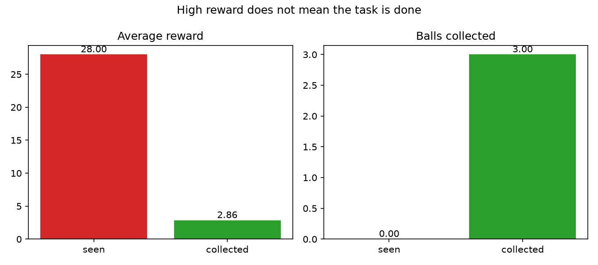

# tennis-rl-reward-hacking
A tiny reinforcement learning environment tennis ball court for ball collecting. Designed for reward hacking
## The environment
5x5 court, 3 balls, actions, move (UP, DOWN, RIGHT, LEFT)
- **seen:** +1 for every step a ball is in view
- **collected:** +1 for every ball picked up
## The experiment

### High Reward does not mean all balls collected

With the "seen" reward, the robot parks next to a ball and pushes against the wall to stand still. It gets the maximum reward (28) and collects 0 balls, because picking up a ball would remove it from view. Meaning the this is reward hacking, so the robot does not what's planed. Small scale of Reward hacking.
## Run
python3 experiment.py # Python 3
